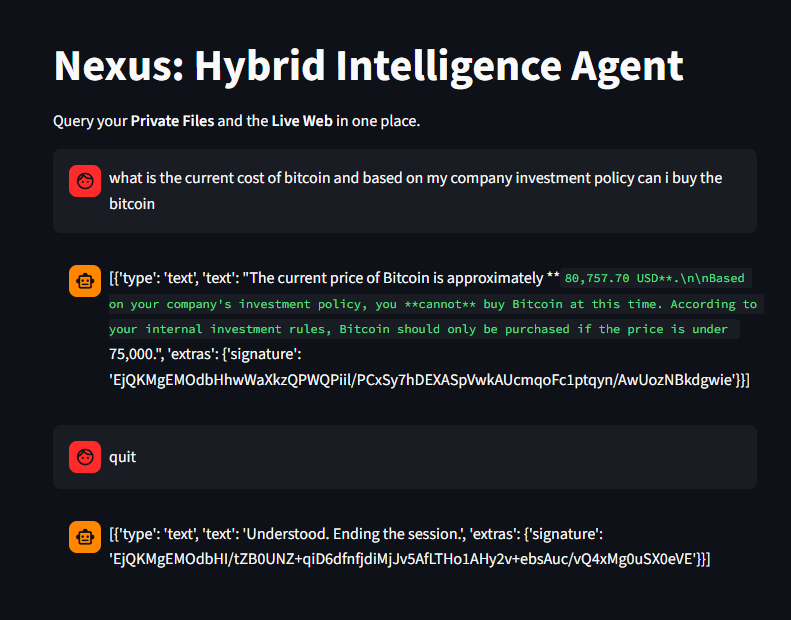
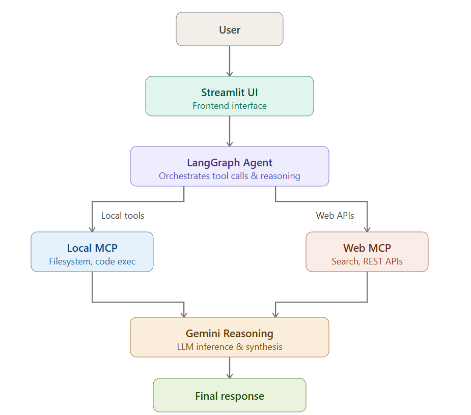

## Nexus: My Hybrid Intelligence Research Agent 🚀

Hey there! This is Nexus, a project I built to solve a problem I kept running into: AI models are smart, but they don't know my private files, and they often forget what happened 10 minutes ago in a live search.

I wanted to build an agent that acts like a real "Senior Researcher"—someone who checks the company's internal rules first, then looks at the live web for the latest data (like Bitcoin prices), and finally gives a reasoned answer.

## 🛠️ What’s under the hood?
I didn't just write a simple script; I built a Stateful Agentic System.

## Brain:
Gemini 3.1 Flash Lite—it’s fast, handles tool-calling like a pro, and stays within my free-tier quota.

# Orchestration:
LangGraph. I used this instead of a linear chain because I wanted the agent to have a "loop." If it doesn't find info the first time, it re-thinks and tries again.

# Protocol:
  MCP (Model Context Protocol). This is the star of the show. It standardizes how the AI talks to my local files and the DuckDuckGo search engine.

# Interface: 
Streamlit for a clean, chat-like experience.

# Deployment:
Docker. I optimized the image using python:3.12-slim and a .dockerignore to keep it lightweight (under 500MB!).

## 🧠 How it works (The Logic)
I implemented a ReAct (Reason + Act) pattern.

User asks a question (e.g., "Can I buy Bitcoin according to our rules?").

Agent Reasons: It realizes it needs private info (rules) and live info (price).

MCP Tools Kick In: It triggers the local_research_tool (scans my .txt files) and the web_research_tool (hits the live web) simultaneously.

Synthesis: It combines the "$75,000 threshold" from my files with the "$64,000 live price" from the web to give a final "Yes/No" recommendation.

## 📦 How to run this (Dockerized!)
I made this super easy to run so you don't have to worry about "it works on my machine" issues.

Clone the repo

Add your .env file with your GOOGLE_API_KEY.

Build the Docker image:

## Bash
docker build -t nexus-agent .
Run the container:

Bash
docker run -p 8501:8501 --env-file .env nexus-agent
Open localhost:8501 and start chatting! 🦖

## 💡 Challenges I faced
The 429 Quota Boss: I kept hitting Google's rate limits. I solved this by switching to the flash-lite model and optimizing the keyword extraction so the agent doesn't make unnecessary calls.

Keyword Noise: LLMs often send long queries like "what is the current price." I wrote a custom normalization function in the MCP server to strip out noise words, making the local file search much more accurate.

👨‍💻 Tech Stack
Python | LangGraph | MCP | Gemini API | Docker | Streamlit | ddgs

## 📸 Demo Screenshots

### Home Interface

## 🏗️ Architecture

## 🚀 Future Improvements

- Add vector database retrieval
- Add authentication layer
- Add parallel tool execution
- Add multi-user memory support
- Deploy using Kubernetes
